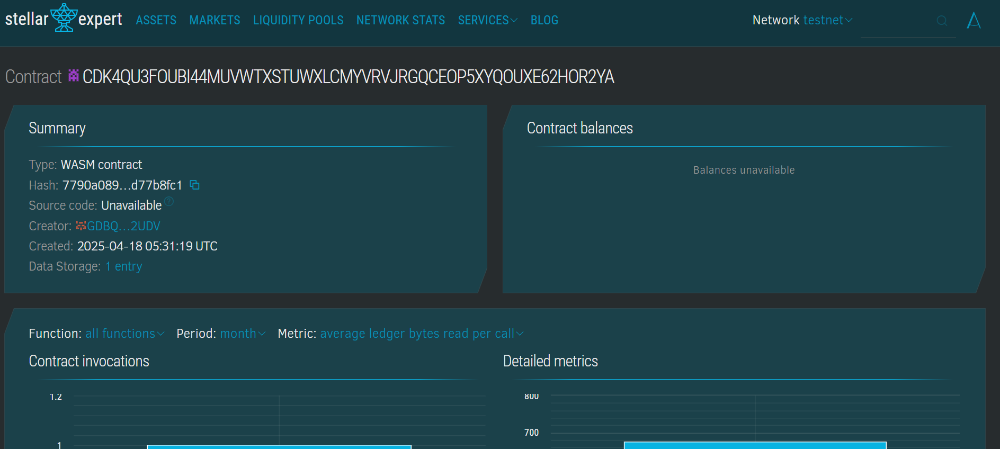

# Simple Escrow Smart Contract

# Project Description

A minimals implementation of an escrow smart contract usings Soroban SDK, allowing two partie (a buyer and a seller) to engage in a trustsed transaction. Funds are held
securely in escrow untils manually released.

## Project Vision

To provide a lightweight and transparent escrows systems for decentralized application, facilitating trustles transactions between parties with minimal overhead.

## Key Features

- **Escrow Initialization:** Setup between buyer and seller with locked fund.
- **Fund Release:** Manual release of funds by an authorized party (e.g., arbitrator or automated condition).
- **State View:** Real-time viewing of escrow status and details.

## Future Scope

- Add supports for time-based or condition-baseds automatic fund release.
- Integrate with Soroban token contract for real fund transfers.
- Multi-party arbitration and dispute resolution.
- Notification system for escrow status changes.
- Web frontend to visualize escrow state.

## Contract Details
CDK4QU3FOUBI44MUVWTXSTUWXLCMYVRVJRGQCEOP5XYQOUXE62HOR2YA

